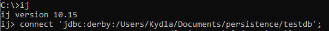
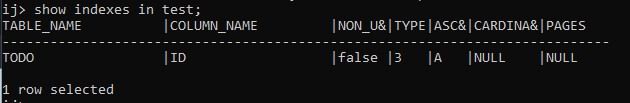
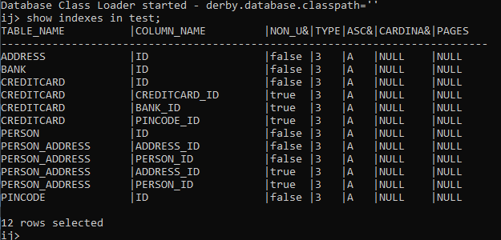

# Report – Software Technology Experiment 2
## Technical problems encountered during installation JPA
Second time around, no issues. :heart:

## Link to experiments
* [Experiment 1](https://github.com/MartinKydland/dat250/tree/master/expa2/expa2-exp1/jpa-basic)
* [Experiment 2](https://github.com/MartinKydland/dat250/tree/master/expa2/expa2-exp2/jpa-basic)

## Inspecting the database tables

Using ij, I successfully inspected which tables were created using the `show indexes from` NoSQL command. Only using `show tables` would view many other generated tables we are not interested in.
The tables looked as anticipated.