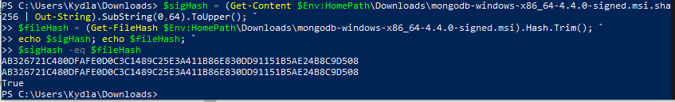
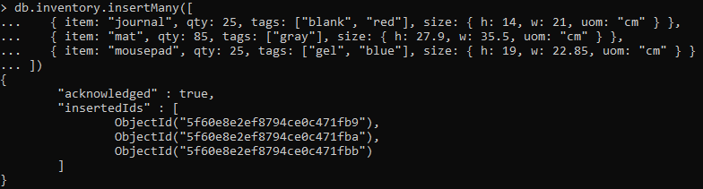
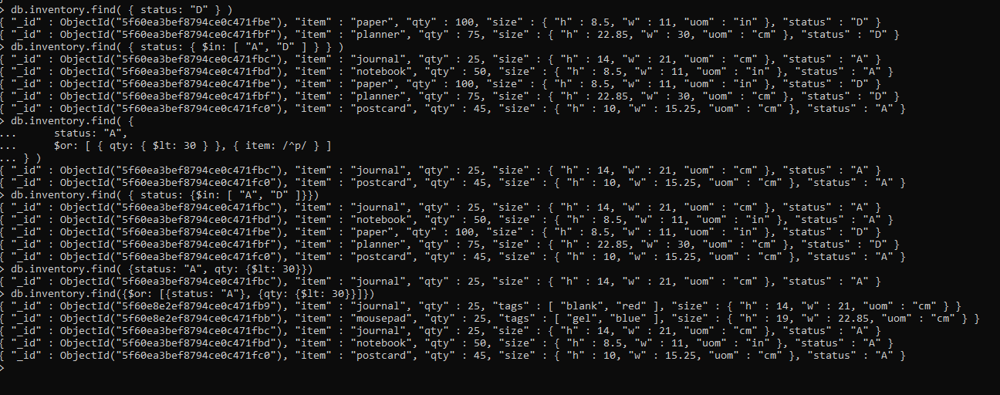
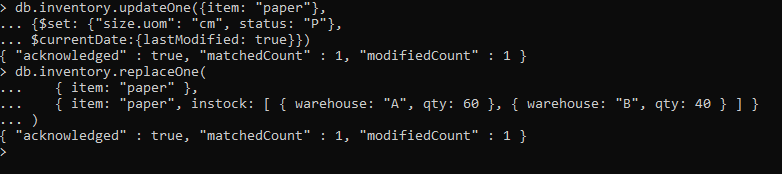
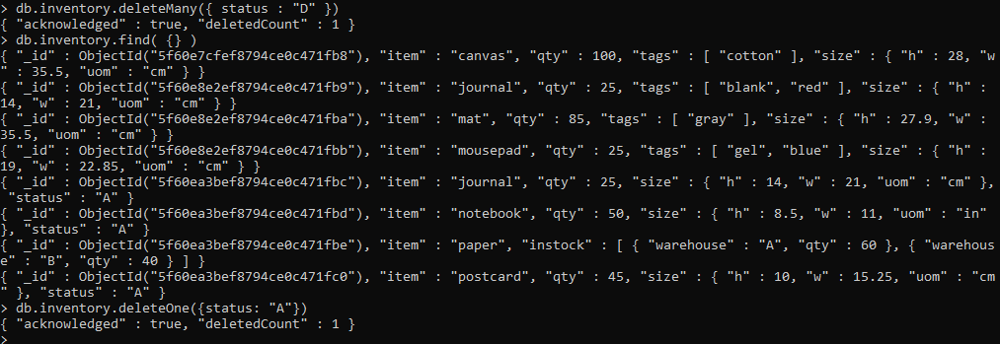
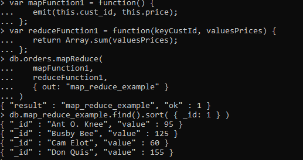
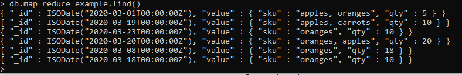

# Report - software technology experiment
## Technical problems during installation of MongoDB:
* I couldn't verify the installation package with a sha-256 checksum. Turns out i had to use powershell instead of command prompt, and it worked.

### Validation of MongoDB:


## CRUD operations:
### Create:


### Read:


### Update:


### Delete:


## Experiment 2 example:


## My own map-reduce function:
```javascript
var mapFunction = function(){
	for (var idx = 0; idx < this.items.length; idx++) {
		var value = {sku: this.items[idx].sku, qty: this.items[idx].qty };
		emit(this.ord_date, value);
	}
};

var reduceFunction = function(ord_date, value){
    qtylist = [];
    for (var idx = 0; idx < value.length; idx++){
        if (qtylist.some(e => e.sku === value[idx].sku)){
            item = (qtylist.find(e => e.sku === value[idx].sku));
            item.qty += (value[idx].qty);
        } else {
            item = {sku: "", qty: 0};
            item.sku = value[idx].sku;
            item.qty = value[idx].qty;
            qtylist.push(item);
        }
    }

    reducedVal = qtylist[0];
    for (var idx = 1; idx < qtylist.length; idx++){
        if(reducedVal.qty < qtylist[idx].qty){
            reducedVal = qtylist[idx];
        } else if (reducedVal.qty == qtylist[idx].qty){
            reducedVal.sku = reducedVal.sku + ", " + qtylist[idx].sku;
        }
    }
    return reducedVal;    
};

db.orders.mapReduce(mapFunction, reduceFunction, {out: "map_reduce_example"});
```
### The result and reasoning:

This is a map reduce operation for finding the most sold item for each given date. This operation can be useful to stores so that they can look at the data to find out which items are being sold most of in a day. Then the sellers are able to plan for next time how much they need to have in stock, so that they don't run out.
Take for example around 17th of may, it would sell a lot of cream for cakes. This gives valuable data on approximately how much cream should be expected to sell the next 17th of may, and the store can place their order on cream accordingly.

In this example, I used the test data from the example. And we can see that apples and oranges were sold the most of the 1st of march, while oranges were sold most of the 23rd of march, at a total quantity of 10. So as you can see, if there is a tie between sold items both will be given.

